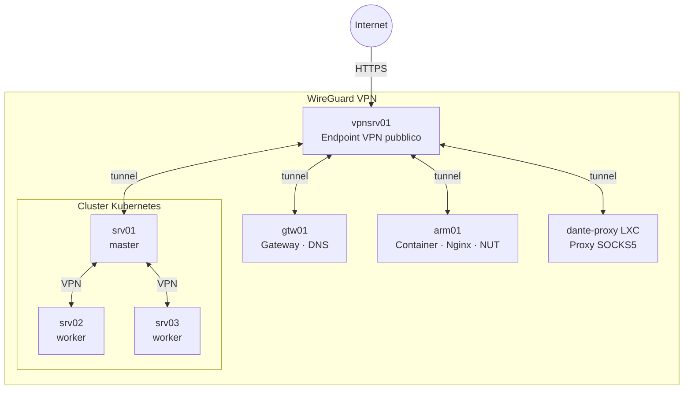

# Home Infrastructure

Automazione Ansible per un laboratorio domestico costruito su un cluster Proxmox con macchine virtuali Fedora CoreOS.

## Obiettivo

Realizzare un'infrastruttura domestica completa composta da:
- **Rete VPN** per l'accesso remoto sicuro a tutti gli host
- **Servizi containerizzati** su un server ARM con Podman
- **Cluster Kubernetes** con Istio service mesh per il deploy delle applicazioni

## Architettura



Gli host del cluster Kubernetes comunicano tramite la VPN WireGuard, garantendo cifratura del traffico interno.

Per la topologia completa consultare [docs/architettura](docs/architettura.md).

## Struttura del repository

Il repository è diviso in tre moduli Ansible indipendenti, ciascuno con il proprio `inventory` e `ansible.cfg`:

| Modulo | Scopo | Documentazione |
|--------|-------|----------------|
| `network_infrastructure/` | VPN WireGuard, DNS dnsmasq, proxy Dante | [→](docs/network_infrastructure.md) |
| `general_configuration/` | Container Podman, Nginx, NUT, firewall UFW | [→](docs/general_configuration.md) |
| `kubernates_infrastructure/` | Cluster Kubernetes, CRI-O, Flannel, Istio | [→](docs/kubernetes_infrastructure.md) |

## Prerequisiti

- Ansible installato sulla macchina di controllo (o Ansible Navigator con podman)
- File `.vault_pass` in ogni modulo (non versionato)
- Directory `host_vars/<hostname>/main.yml` per ogni host target (non versionata)
- Accesso SSH agli host con chiave configurata

## Esecuzione rapida

Ogni playbook va eseguito dall'interno della directory del modulo:

```bash
# 1. Configurare la rete VPN
cd network_infrastructure
ansible-playbook setup_network_play.yml
ansible-playbook setup_dns_play.yml
ansible-playbook setup_proxy_play.yml  # Proxy SOCKS5 (LXC Dante)

# 2. Configurare i servizi su arm01
cd general_configuration
ansible-playbook setup_firewall_play.yml
ansible-playbook setup_containers_play.yml
ansible-playbook setup_nginx_play.yml

# 3. Installare il cluster Kubernetes
cd kubernates_infrastructure
ansible-playbook playbook.yml
```

## Gestione dei segreti

I segreti sono cifrati con `ansible-vault`. La password vault è letta automaticamente dal file `.vault_pass` in ogni modulo.

```bash
# Cifrare una variabile
ansible-vault encrypt_string 'valore_segreto' --name 'nome_variabile'

# Editare un file cifrato
ansible-vault edit host_vars/<host>/vault.yml
```

I file `host_vars/`, `wireguard_keys/`, `context/` e `.vault_pass` sono esclusi dal versionamento.

## Infrastruttura fisica

| Host | Ruolo |
|------|-------|
| vpnsrv01 | VPS pubblica, endpoint VPN |
| gtw01 | Gateway, DNS |
| arm01 | Server ARM, servizi container |
| srv01 | Kubernetes master |
| srv02 | Kubernetes worker |
| srv03 | Kubernetes worker |
| node01 | Nodo Proxmox |
| node02 | Nodo Proxmox |
| dante-proxy | LXC su node01, proxy SOCKS5 Dante |
| mns01 | Mainsail (stampante 3D) |
