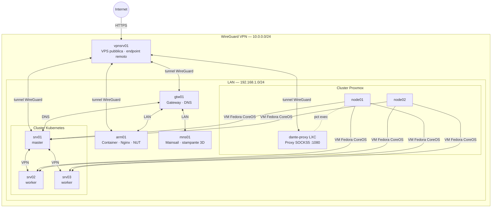
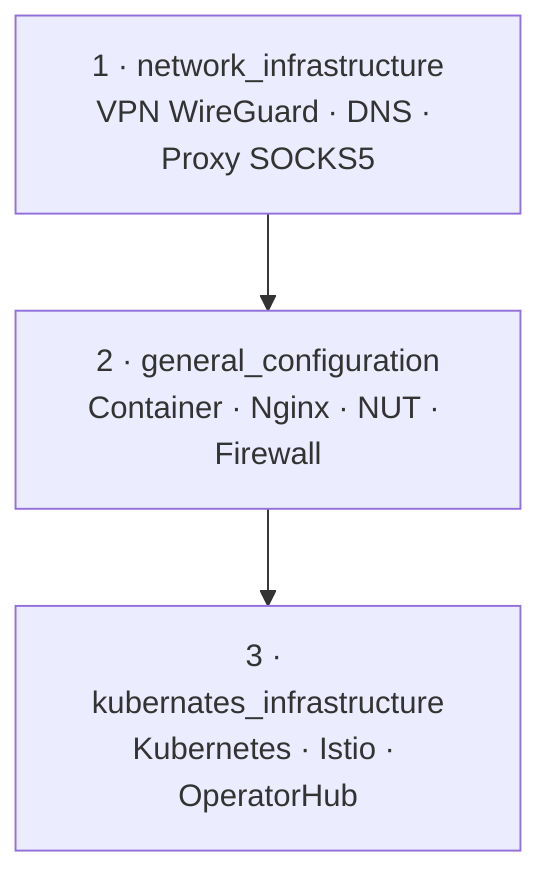

# Architettura dell'Infrastruttura

## Panoramica

Il laboratorio domestico si compone di tre strati sovrapposti: una rete fisica LAN, una rete VPN overlay costruita con WireGuard, e un cluster Kubernetes che usa la VPN come rete di trasporto per il piano di controllo.

## Reti

| Rete | Scopo |
|------|-------|
| LAN | Rete fisica locale |
| WireGuard VPN (`10.0.0.0/24`) | Overlay cifrato tra tutti gli host |

Il cluster Kubernetes usa gli indirizzi VPN per la comunicazione interna tra nodi, disaccoppiando il cluster dalla topologia fisica della LAN.

## Host

| Host | Ruolo |
|------|-------|
| vpnsrv01 | VPN server pubblico (endpoint remoto) |
| gtw01 | Gateway, DNS (dnsmasq), VPN hub |
| arm01 | Server ARM, container Podman, nginx, NUT |
| srv01 | Kubernetes master |
| srv02 | Kubernetes worker |
| srv03 | Kubernetes worker |
| node01 | Nodo Proxmox |
| node02 | Nodo Proxmox |
| dante-proxy | LXC su node01 — proxy SOCKS5 Dante, VPN + LAN |
| mns01 | Controller stampante 3D (Mainsail) |

## Stack tecnologico

| Livello | Tecnologia |
|---------|-----------|
| Virtualizzazione | Proxmox VE |
| Sistema operativo VM | Fedora CoreOS |
| VPN | WireGuard |
| DNS | dnsmasq |
| Proxy SOCKS | Dante (LXC su Proxmox) |
| Container | Podman + Quadlet |
| Reverse proxy | Nginx + Certbot |
| Monitoraggio UPS | NUT (Network UPS Tools) |
| Firewall (arm01) | UFW |
| Orchestrazione | Kubernetes (kubeadm) |
| Container runtime K8s | CRI-O |
| CNI | Flannel |
| Service mesh | Istio (via Helm) |
| Operator framework | OperatorHub |

## Moduli Ansible

Il repository è diviso in tre moduli indipendenti, ciascuno con il proprio `ansible.cfg` e `inventory`. Possono essere eseguiti in qualsiasi ordine, ma la sequenza consigliata è:

Per i dettagli di ogni modulo consultare la documentazione specifica:
- [Network Infrastructure](network_infrastructure.md)
- [General Configuration](general_configuration.md)
- [Kubernetes Infrastructure](kubernetes_infrastructure.md)
