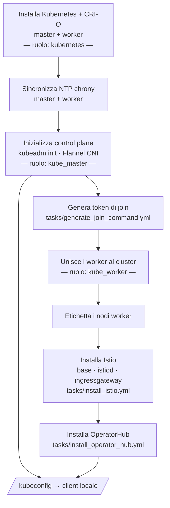

# Kubernetes Infrastructure

Questo modulo installa e configura un cluster Kubernetes completo con Istio service mesh e OperatorHub. Il cluster usa la rete WireGuard VPN come rete di trasporto tra i nodi.

## Prerequisiti

- File `.vault_pass` presente nella directory `kubernates_infrastructure/`
- Directory `host_vars/<hostname>/main.yml` creata per `srv01`, `srv02`, `srv03` (non versionata)
- WireGuard VPN attiva tra i nodi (modulo `network_infrastructure` già eseguito)
- Accesso SSH agli host con chiave configurata

## Topologia del cluster

| Host | Ruolo K8s |
|------|-----------|
| srv01 | Control plane (master) |
| srv02 | Worker |
| srv03 | Worker |

Tutti i nodi comunicano tramite la rete WireGuard VPN. Il client locale (`localhost` / `cli01`) riceve il kubeconfig al termine dell'installazione.

## Esecuzione

Il modulo ha un unico playbook che esegue l'installazione completa in sequenza:

```bash
cd kubernates_infrastructure
ansible-playbook playbook.yml
```

Per eseguire solo una parte specifica usando i tag:

```bash
# Solo installazione base Kubernetes
ansible-playbook playbook.yml --tags kubernetes

# Solo Istio
ansible-playbook playbook.yml --tags istio

# Pulire l'infrastruttura esistente (reset del cluster)
ansible-playbook playbook.yml --tags clean
```

## Flusso di installazione

Il `playbook.yml` esegue 13 play in sequenza:



Il kubeconfig viene salvato nella directory `context/` (gitignored).

## Ruoli

### kubernetes (installazione base)

Eseguito su tutti i nodi (master e worker):

1. Imposta l'hostname del nodo
2. Installa `kubeadm`, `kubelet`, `kubectl` e CRI-O
3. Carica i moduli kernel richiesti: `overlay`, `br_netfilter`
4. Configura sysctl per il networking Kubernetes
5. Avvia e abilita `crio` e `kubelet`
6. Disabilita lo swap
7. Disabilita il firewall (il cluster usa la VPN per l'isolamento)

### kube_master (control plane)

1. Inizializza il cluster con `kubeadm init` usando l'IP VPN
2. Configura il kubeconfig di amministrazione
3. Installa Flannel come CNI
4. Patcha il DaemonSet di Flannel per usare l'interfaccia WireGuard
5. Configura CoreDNS
6. Pulisce le interfacce di rete residue (`cni0`, `flannel.1`) se necessario

### kube_worker (nodi worker)

1. Unisce il nodo al cluster con il token generato dal master
2. Configura l'IP VPN e l'hostname nel kubelet
3. Crea il file di configurazione Flannel (`10-flannel.conflist`)

## Componenti installati

### Flannel CNI

Flannel usa l'interfaccia WireGuard come `iface` per il traffico pod-to-pod tra nodi. Questo garantisce che tutto il traffico del cluster viaggi cifrato attraverso la VPN.

### Istio Service Mesh

Installato via Helm nei namespace `istio-system` e `istio-ingress`:

- `istio/base` — CRD e configurazione base
- `istiod` — Control plane Istio
- `istio-ingressgateway` — Ingress gateway nel namespace `istio-ingress`

### OperatorHub

Framework per la gestione degli operator Kubernetes. Permette l'installazione di software complesso tramite `OLM` (Operator Lifecycle Manager).

## Reset del cluster

Per resettare completamente l'infrastruttura Kubernetes:

```bash
cd kubernates_infrastructure
ansible-playbook playbook.yml --tags clean
```

Il task `tasks/clean_infrastructure.yml` esegue `kubeadm reset` su tutti i nodi e rimuove i file di configurazione.
