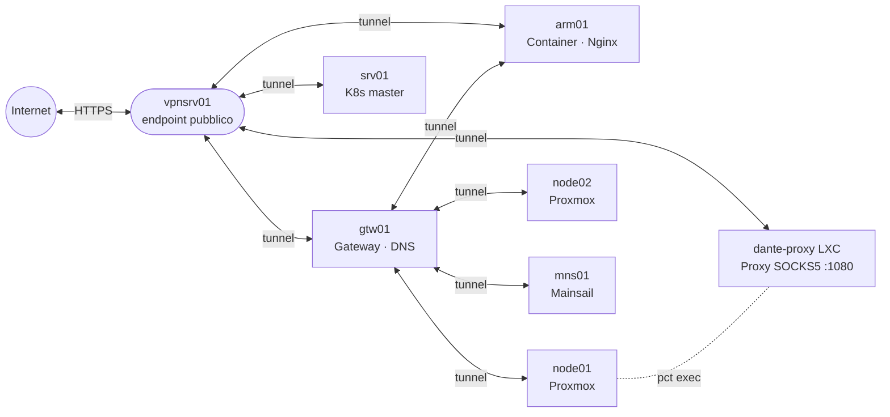

# Network Infrastructure

Questo modulo configura la rete overlay VPN, il server DNS e il proxy SOCKS per tutti gli host del laboratorio.

## Prerequisiti

- File `.vault_pass` presente nella directory `network_infrastructure/`
- Directory `host_vars/<hostname>/main.yml` creata per ogni host target (non versionata)
- Accesso SSH agli host con chiave configurata

### Variabili richieste per host (host_vars)

| Variabile | Descrizione |
|-----------|-------------|
| `hostname` | Nome host senza dominio (usato da dnsmasq per impostare `<hostname>.private`) |
| `wireguard_*` | Indirizzi IP WireGuard, chiavi pubbliche dei peer |

Le chiavi WireGuard vengono generate automaticamente dal ruolo e salvate in `wireguard_keys/` (gitignored).

## Playbook

### setup_network_play.yml — WireGuard VPN

Configura WireGuard su tutti gli host: `gateway`, `client`, `armsrv`, `virtualization`, `vpnserver`, `mainsail`, `srv01`.

```bash
cd network_infrastructure
ansible-playbook setup_network_play.yml

# Solo un gruppo di host
ansible-playbook setup_network_play.yml --limit gateway
```

**Cosa fa il ruolo `wireguard`:**
1. Rileva il gestore di rete presente (Netplan, NetworkManager o wg-quick)
2. Rileva il package manager (apt, dnf, rpm-ostree per CoreOS)
3. Genera una coppia di chiavi WireGuard per l'host e la registra
4. Abilita IP forwarding IPv4 e IPv6
5. Installa WireGuard
6. Scrive la configurazione di rete appropriata al gestore rilevato
7. Configura FirewallD per permettere il traffico WireGuard

### setup_proxy_play.yml — Proxy SOCKS5 Dante (LXC Proxmox)

Crea e configura un container LXC su Proxmox con il proxy SOCKS5 Dante e WireGuard.

```bash
cd network_infrastructure
ansible-playbook setup_proxy_play.yml
```

**Sequenza di esecuzione:**
1. **`proxynodes`** → crea il container LXC `dante-proxy` su Proxmox via API token, lo avvia e lo aggiunge all'inventory in-memory
2. **`lxc_containers`** → configura WireGuard nel container (genera chiavi, installa, connette al VPN server)
3. **`vpnserver`** → riconfigura WireGuard sul VPN server aggiungendo `dante-proxy` come peer
4. **`lxc_containers`** → installa e configura Dante

Il container usa l'IP LAN per l'accesso a Internet e un IP VPN tramite WireGuard. Il proxy è in ascolto su entrambe le interfacce sulla porta `1080` senza autenticazione.

**Variabili richieste in `host_vars/<nodo-proxmox>/main.yml`:**
```yaml
proxmox_lxc_api_host: <ip-nodo-proxmox>
proxmox_lxc_api_user: root@pam
proxmox_lxc_api_token_id: <nome-token>
proxmox_lxc_api_token_secret: !vault |...
proxmox_lxc_containers:
  - container_name: dante-proxy
    vmid: <vmid>
    ip: <ip-lan>/24
    gateway: <gateway-lan>
    nameserver: "1.1.1.1 8.8.8.8"
    ostemplate: local:vztmpl/debian-12-standard_12.12-1_amd64.tar.zst
    groups: [lxc_containers]
```

**Nota:** La connessione SSH al container usa un `ProxyCommand` via `pct exec` sul nodo Proxmox, poiché il container non è raggiungibile direttamente dalla macchina di controllo.

### setup_dns_play.yml — DNS con dnsmasq

Configura il server DNS sull'host `gateway`.

```bash
cd network_infrastructure
ansible-playbook setup_dns_play.yml
```

**Cosa fa:**
1. Imposta l'hostname a `<hostname>.private`
2. Aggiorna `/etc/hosts`
3. Disabilita `systemd-resolved` per evitare conflitti
4. Installa e configura dnsmasq
5. Apre la porta DNS nel firewall

## Ruoli

### wireguard

Supporta tre modalità di configurazione della rete in base a quanto trovato sull'host:
- **Netplan** (Ubuntu/Debian)
- **NetworkManager** (Fedora)
- **wg-quick** (fallback generico)

Supporta tre package manager:
- `apt` (Debian/Ubuntu)
- `dnf` (Fedora)
- `rpm-ostree` (Fedora CoreOS — richiede reboot)

### dnsmasq

Usa template Jinja2 per generare la configurazione. I file di configurazione si trovano nei template del ruolo.

### proxmox_lxc

Crea container LXC su Proxmox via API token. Parametri principali:
- `proxmox_lxc_api_host`, `proxmox_lxc_api_user`, `proxmox_lxc_api_token_id/secret` — credenziali API
- `proxmox_lxc_containers` — lista di container da creare (vmid, ip, gateway, ostemplate, ecc.)

Dopo la creazione aggiunge ogni container all'inventory in-memory con ProxyCommand via `pct exec` (necessario perché il container non è raggiungibile direttamente).

### dante

Installa il server proxy SOCKS5 Dante (`dante-server`) e lo configura tramite template Jinja2.
Scrive la configurazione in `/etc/danted.conf` (percorso letto dal servizio systemd Debian).

Parametri principali in `host_vars/<hostname>/main.yml`:
```yaml
dante:
  interface_ip: "eth0"        # interfaccia o IP su cui ascoltare (supporta lista)
  port: 1080
  interface: eth0             # interfaccia esterna per il traffico in uscita
  socks_method: "username none"
  client_method: none
  client_pass_rules:
    - from: "10.0.0.0/8"
      to: "0.0.0.0/0"
      log: "connect error"
  socks_pass_rules: [...]
  client_deny_rules: [...]
```

## Topologia VPN



Tutti gli host fanno parte di una rete WireGuard `10.0.0.0/24`. Il gateway `gtw01` funge da hub centrale per il routing VPN sulla LAN. Il server pubblico `vpnsrv01` permette l'accesso remoto dall'esterno della LAN.

Il container `dante-proxy` (LXC su Proxmox) espone un proxy SOCKS5 sulla porta `1080`, accessibile sia dalla LAN che dalla VPN. Non richiede autenticazione, ma accetta connessioni solo dalle subnet LAN e VPN.
